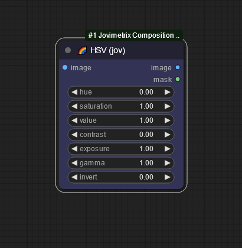
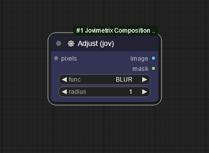

> [!CAUTION]
> <h4><p align="center">⚠️⚠️ NODES SUBJECT TO CHANGE PRIOR TO VERSION 1.0. USE AT YOUR OWN RISK ⚠️⚠️</p></h4>

<picture>
  <source media="(prefers-color-scheme: dark)" srcset="res/logo-jovimetrix.png">
  <source media="(prefers-color-scheme: light)" srcset="res/logo-jovimetrix-light.png">
  
</picture>


</img>

<h3><p align="center">
<a href="https://github.com/comfyanonymous/ComfyUI">COMFYUI</a> Nodes for procedural masking, live composition and video manipulation
</p></h3>

<!-------------------------------------------------------------------------------------------------------------------------------------------------------->

# INSTALLATION

If you have [ComfyUI Manager](https://github.com/ltdrdata/ComfyUI-Manager) installed you can search for Jovimetrix and install from the manager's database.

## MANUAL INSTALL
To manually install, clone the repository into your ComfyUI custom_nodes directory. You can clone the repository with the command:
```
git clone https://github.com/Amorano/Jovimetrix.git
```
You can then install the requirements by using the command:
```
.\python_embed\python.exe -s -m pip install -r requirements.txt
```
If you are using a <code>virtual environment</code> (<code><i>venv</i></code>), make sure it is activated before installation. Then install the requirements with the command:
```
pip install -r requirements.txt
```

<!-------------------------------------------------------------------------------------------------------------------------------------------------------->

# REFERENCE

<h2><p align="center">
<code>COPY EXAMPLE IMAGES INTO COMFYUI WINDOW TO LOAD DEPICTED WORKFLOW</code>
</p></h2>


</img>

<details>
  <summary><b>CAPTURE</b></summary>
  <ul>
    <li>Connect system devices directly into ComfyUI workflows</li>
    <li></li>
  </ul>

NODE | OVERVIEW | COMFY UI
---|---|---
WEBCAM||
  <ul>
    <details>
      <summary><b>WEBCAM EXAMPLE</b></summary>
      
      </img>
      
      </img>
      
      </img>
    </details>
  </ul>
</details>

<details>
  <summary><b>CREATE</b></summary>
  <ul>
    <li>A constant color node for when you need a block of color</li>
    <li>Nodes that generate images and masks to further be manipulated
      <ul>
        <li>Ellipse & Circle</li>
        <li>Rectangle & Square</li>
        <li>Polygon of 3 or more sides</li>
      </ul>
    </li>
    <li>Old-school version of a PerPixel shader -- slow but works until the  is available. Variables pre-defined for use in the loop include:
      <ul>
        <li><code>$x</code>, <code>$y</code>: Current image (x, y)</li>
        <li><code>$u</code>, <code>$v</code>: Normalized texuture coordinates [0..1]</li>
        <li><code>$w</code>, <code>$h</code>: Width and Height of the target output</li>
        <li><code>$ir</code>, <code>$ig</code>, <code>$ib</code>: Red, Green & Blue values for current image input (x, y)</li>
      </ul>
    </li>
  </ul>

NODE | OVERVIEW | COMFY UI
---|---|---
CONSTANT|Set a single RGB value. Useful for masks, overlays and general filtering|
SHAPE GENERATOR|Generate polyhedra for masking or texture work|
PER PIXEL SHADER|Two nodes, one with source Image support. Allows user function to generate a per pixel result into an image of (Width x Height)|

  <details>
    <summary><b>PER PIXEL SHADER EXAMPLE</b></summary>
    
    </img>
  </details>
</details>

<details>
  <summary><b>TRANSFORM</b></summary>
  <ul>
    <li>TRANSFORM. Translate, Rotate, and Scale an input. Options allow for CROP or WRAPing of the edges</li>
    <li>MIRROR. Flip an input across the X axis, the Y Axis or both, with independant centers</li>
    <li>TILE. Repeat an input along the X, Y or XY at irregular intervals</li>
    <li>EXTEND. Combine two inputs into a new image, side by side or top-down</li>
  </ul>
NODE | OVERVIEW | COMFY UI
--|---|---
WEBCAM||
WEBCAM||
WEBCAM||
WEBCAM||

  <details>
    <summary><b>PER PIXEL SHADER EXAMPLE</b></summary>
    
    </img>
  </details>
</details>

<details>
  <summary><b>ADJUST</b></summary>
  <ul>
    <li>Manipulate lighting and color conditions of an input</li>
    <li>Apply matrix operations to images and masks</li>
  </ul>

NODE | OVERVIEW | COMFY UI
--|---|---
HSV|Adjust Hue, Saturation, Value, Gamma, Contrast and Exposure of an input|
ADJUST|Find Edges, Blur, Sharpen and Emobss an input|

  <details>
    <summary><b>PER PIXEL SHADER EXAMPLE</b></summary>
    
    </img>
  </details>
</details>

<details>
  <summary><b>COMPOSE</b></summary>
  <ul>
    <li>Composite Images and Masks together with optional alpha blending.</li>
    <li>Supports many operations; if there is a favorite mode missing</li>

[feel free to email me](<mailto:amorano@gmail.com?subject=[GitHub] Jovimetrix>)

NODE | OVERVIEW | COMFY UI
--|---|---
⚗️ BLEND MASK|Compose 2 inputs together an alpha mask and linear blend scalar|
⚗️ BLEND|Compose 2 inputs together with linear blend scalar|
  </ul>
  <ul>
    <details>
      <summary><b>BLEND WITH MASK EXAMPLE</b></summary>
      
      </img>
    </details>
    <details>
      <summary><b>BLEND EXAMPLE</b></summary>
      
      </img>
    </details>
  </ul>
</details>

<!-------------------------------------------------------------------------------------------------------------------------------------------------------->
-----

## TODO:
- [✔️] create readme
- [✔️] embed workflows in example images
- [⭕] specific single examples for all nodes
- [⭕] hook GLSL context in litegraph

